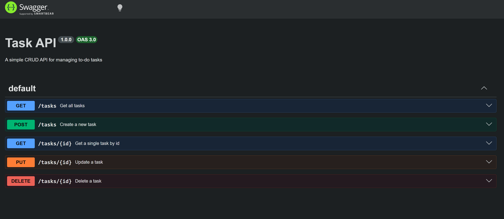
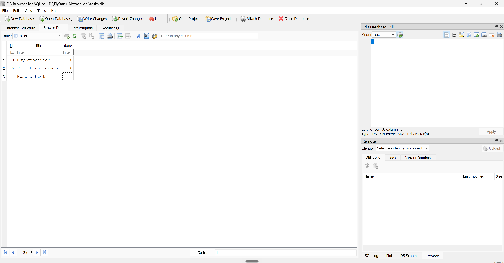

# Task API

# Task API

A simple CRUD API for managing a to-do list, built with Node.js, Express, and SQLite.

Built as part of the **FlyRank AI Backend Internship**.

- Week 2 (Assignment A1): Built a CRUD API using in-memory storage.
- Week 3 (Assignment A2): Migrated the storage layer to SQLite while keeping the same API endpoints.

## Features

- Full CRUD (Create, Read, Update, Delete) for tasks
- SQLite database for persistent storage
- Automatic database and table creation
- Automatic seeding of sample tasks on first run
- Input validation
- Interactive API documentation using Swagger UI

## Tech Stack

- Node.js
- Express.js
- SQLite
- better-sqlite3
- Swagger UI (swagger-ui-express)

## How to Run

1. Clone this repo:
 - git clone https://github.com/sushmitakoti661-prog/Backend-01.git 
 - cd Backend-01

2. Install dependencies:
 - npm install

3. Start the server:
 - node server.js

4. Open the API

- API Base URL: `http://localhost:3000`
- Swagger Documentation: `http://localhost:3000/docs`

### Database

The application automatically creates a SQLite database file named `tasks.db` when the server starts.

If the database or the `tasks` table does not exist, they are created automatically.

On the first run, the application inserts three sample tasks into the database. On later runs, the seed data is **not** inserted again.

## Endpoints

| Method | Path | Description |
|--------|------|-------------|
| GET | / | API info |
| GET | /health | Health check |
| GET | /tasks | Get all tasks |
| GET | /tasks/:id | Get one task by id |
| POST | /tasks | Create a new task |
| PUT | /tasks/:id | Update a task |
| DELETE | /tasks/:id | Delete a task |

## Example Request
curl.exe -i http://localhost:3000/tasks

HTTP/1.1 200 OK
X-Powered-By: Express
Content-Type: application/json; charset=utf-8
Content-Length: 184
ETag: W/"b8-EXcF2VmgAmLt5uQ9nLDmeGyvUMA"
Date: Sun, 19 Jul 2026 22:29:33 GMT
Connection: keep-alive
Keep-Alive: timeout=5

[{"id":1,"title":"Buy groceries","done":false},{"id":2,"title":"Finish assignment","done":false},{"id":3,"title":"Read a book","done":true},{"id":4,"title":"Go for a Run","done":true}]

## Swagger UI

Interactive docs available at `http://localhost:3000/docs`



## Notes

### Why SQLite?

SQLite was chosen because it is lightweight, requires no separate database server, and stores all data in a single file (`tasks.db`). It is easy to set up and is a good choice for small applications and learning backend development.

### Database File

The database file (`tasks.db`) is created automatically when the application starts if it does not already exist.

The file is ignored by Git (`.gitignore`) so every new clone of the repository creates its own fresh database automatically.

### Example SQL Query

The following SQL query was executed during Stage 4:

```sql
SELECT * FROM tasks;
```

This query returns all tasks stored in the database.

### Windows Note

Since this project was built on Windows, PowerShell's `Invoke-RestMethod` / `Invoke-WebRequest` was sometimes used instead of `curl` for POST and PUT requests because of PowerShell's JSON quoting behavior.

## SQLite Database

Below is the SQLite database opened in DB Browser after completing the migration from in-memory storage.

